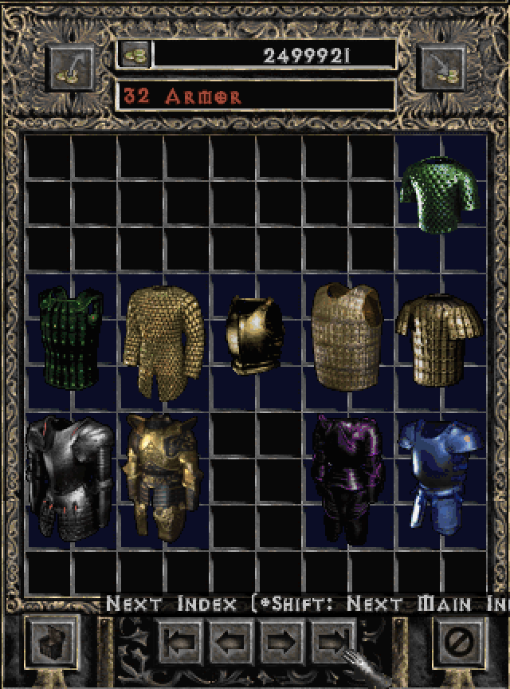
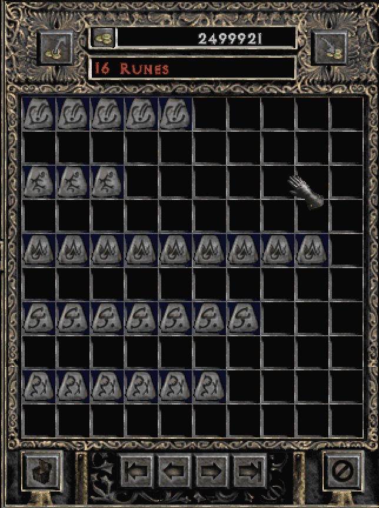
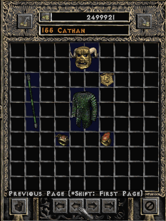
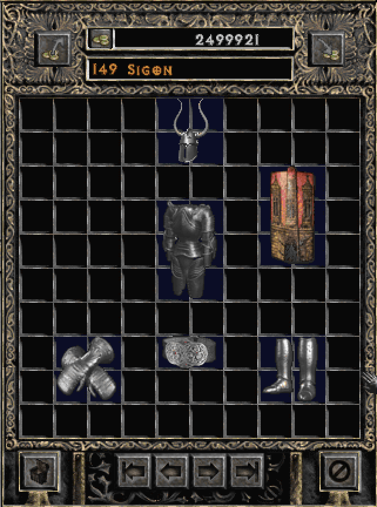

# d2-stash-organizer
Diablo 2 Plugy stash organizer

Web-based PlugY stash organizer and grail tracker hosted at: https://youdz.github.io/d2-stash-organizer/

## Features
- It reads your whole shared stash file (.sss) in one click, and lets you search easily for items in it. 
  No more "Where did I put my spare 35% Spirit?". Just type "Spirit" in the search box, see which pages have a Spirit, and even which one is the perfect one.
- It organizes your entire stash for you in one click too, and lets you download the cleaned up stash file to use directly in game. 
  It names pages nicely, adds indices between sections, and even lays out sets nicely on their own page.
- It tracks grail progress, even eth grail and perfect grail if you're that kind of crazy.

## Security and privacy
Everything runs in the browser: no installation required, no coding, no security risks for your computer. 

Your data is your data, the tool does not send anything to the server. It works fully offline once loaded.
This means your save files will never be sent or shared anywhere, and it does not track any kind of statistics.

Finally, this tool will never lose any of your items. There is a hard check at the end of the organization logic
that will throw an error and prevent generating a new save file if even one potion is missing. It will also
never modify your items, only move them around. The tool does not have the capability to modify item mods, the
only fields that can be modified at the moment are the position.

## Item sort order

The tool organizes items in the following order:
- Unrecognized items (if you get any, please tell me so I can add support for them)
- Rejuvs
- Essences and tokens
- Organs and keys
- Gems: Every gem type gets its own page(s), each page sorted by grade of gem (from chipped to perfect)
- Runes by rank, with an empty line between each rank for clarity
- Bases (white and grey items), ordered by:
  - equipment type (same order as the equipment sections below)
  - within each equipment type, sorted by descending qlevel (meaning Sacred Armor first and Quilted Armor last, for instance)
  - within each qlevel, sorted by number of sockets (useful if you have 12 Crystal Swords)
- Runewords sorted by level requirement
- For each type of possibly unique item (rings, amulets, charms, jewels, armor, helms, gloves, ...):
  - One of each unique displayed in "grail mode", one page per tier (normal, exceptional, elite) if they don't fit in one page
  - One of each eth unique displayed in "grail mode"
  - Duplicate uniques sorted by descending qlevel
  - Rares sorted by descending qlevel
  - Magic items sorted by descending qlevel
- For each set
  - A first pretty page with the set fully laid out
  - Duplicate items of the same set, grouped by which piece it is, just laid out in line.
  
Examples:

## Contributing

### Folder structure

The project is organized in the following folders:
- `src/`: Probably obvious, contains the Typescript source code for the project.
  - `game-data/`: Logic for parsing the game files and extracting what we need in JSON format. nothing in here should ever be imported in the web tool, only executed to fix a game data bug or to extract more information.
  - `scripts/`: Business logic for anything "smart" the tool does. Parsing game files, organizing a stash, listing a grail, etc. These can are imported and used in the web tool, but can also be ran with a standalone Node script for experimentation or debugging.
  - `web/`: The web UI, written with Preact and bundled with Rollup. No business logic should ever go here, only views and view models.
- `game-data/`: Raw game data like unique items definitions, magical mods and texts.
  - `json/`: Cleaned up JSON data that we extracted automatically. **Never** modify any of these files manually, see scripts below.
  - `txt/`: The game's `.tbl` files simply renamed to `.txt`, but completely unmodified. Once again, these files should never be modified manually.
- `docs/`: The production bundle of our web UI, which is automatically hosted on the project's [github.io page](https://youdz.github.io/d2-stash-organizer/). The name might be surprising, but this is a GitHub naming convention. Here too, never modify these files manually.
- `test/`: Git-ignored folder used to store private stash information safely when testing directly with Node instead of the web version.

### Available scripts

For local development:
- `npm install` pulls dependency from NPM.
- `npm run watch` runs the project in watch mode on http://localhost:10001.
- `npm run start` runs `src/scripts/main.ts` in Node, which is a messy playground used for debugging. Before running it, make sure you modified `src/scripts/main.ts` for your use case.

Scripts you shouldn't need to run for most contributions:
- `npm run game-strings` re-generates the JSON containing all game texts, useful if you want to port this tool in a different language and have access to the game's Strings files.
- `npm run game-data` re-generates the JSON-formatted game data (depends on game strings), mostly ran if you want to pull more data than we currently do from the game .tbl files.

Publishing a new version of the web tool:
- `npm run build` bundles `src/web/` for production and replaces the previous version in `docs/` with it. This last script is the reason why the source code in `src/` might not match the deployed version. Multiple commits might be needed for a feature to be ready, and only once it ready will this script be ran to publish it.

  